# HRMS Project Workflow Documentation

## 1. Project Overview

This HRMS project is a multi-tenant workforce management system built with a React frontend and an Express/MongoDB backend. It supports four major user roles:

- Master Admin: platform-level owner who manages subscribed companies/admins, plan settings, login access, issues, domains, and demo requests.
- Admin: tenant/company owner who manages employees, support admins, attendance, leave, payroll, subscriptions, documents, and operational settings.
- Support Admin: delegated administration user created by an Admin, with assigned permissions and its own attendance/profile workflow.
- Employee: company employee who uses attendance, leave, overtime, notices, work tracker, documents, payroll, and requests.

The backend follows a common route -> middleware -> controller/route handler -> model -> MongoDB workflow. The frontend follows React route protection -> layout -> page load -> API call -> state update -> UI render.

## 2. Overall Project Workflow

1. User opens the app.
   - Public pages load from React routes such as `/`, `/login`, `/request-demo`, `/master`, `/employee-onboarding`, and `/document-verification`.
   - Logged-in users are redirected away from public pages by `PublicRoute` in `FRONTEND/src/App.jsx`.

2. Login and authentication.
   - Normal users authenticate through `AuthProvider`.
   - The frontend first tries `/api/admin/login` for admin/support-admin accounts.
   - If admin login returns `401`, it falls back to `/api/auth/login` for employee login.
   - Master Admin logs in through `/api/master/login`.
   - Face and fingerprint flows use `/api/face-auth` and `/api/webauthn`.

3. Role detection.
   - Login response contains a JWT and `user.role`.
   - Roles are stored in `sessionStorage` through `hrmsUser`, `token`, `hrms-token`, or `masterToken`.
   - React routing checks the role and redirects to the correct dashboard.

4. Route protection.
   - Frontend protection happens in `ProtectedRoute.jsx`.
   - Backend protection happens through `protect` in `authController.js`, `authMiddleware.js`, or `middleware/protect.js`.
   - Master routes use `protectMaster`.
   - Admin-only routes use `onlyAdmin`.
   - Subscription expiry is checked after login and during protected API access through `subscriptionAccess.js`.

5. Dashboard loading.
   - Layout components mount after route protection.
   - Context providers fetch shared data such as employees, notices, attendance, leave, overtime, and notifications.
   - Dashboard pages call backend endpoints and render cards, charts, tables, and request counters.

6. API requests.
   - Frontend uses the configured Axios instance in `FRONTEND/src/api.js`.
   - Axios attaches the best available token from `sessionStorage`.
   - Backend validates JWT, resolves the current user, scopes requests by `adminId` and/or `companyId`, and returns JSON.

7. Database operations.
   - MongoDB stores data through Mongoose models.
   - Core tenant data is linked by `adminId`.
   - Employee-specific data is linked by `employeeId`, `company`, and `adminId`.
   - Company-level data uses `companyId`.

8. Response handling and UI updates.
   - Pages or context providers store response data in React state.
   - Forms show success/error messages through alerts, SweetAlert, toasts, or inline UI.
   - Some modules emit Socket.IO events to refresh request counters or notify dashboards.

## 3. Complete System Workflow

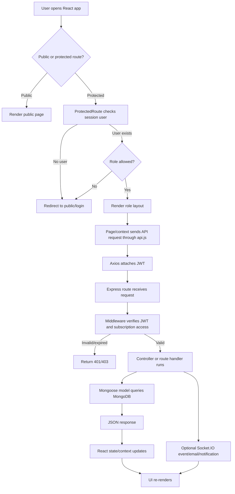

## 4. Authentication Flow

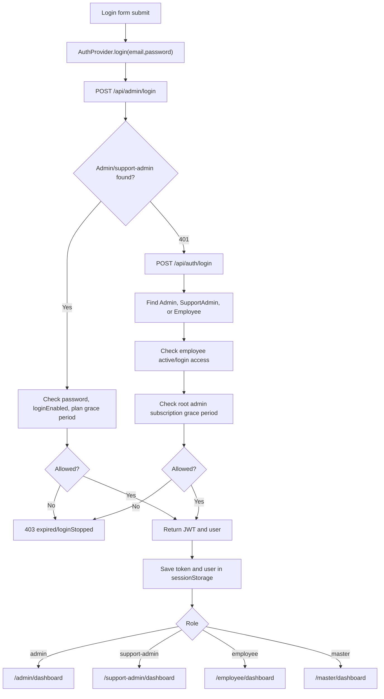

## 5. Role-Based Workflows

### 5.1 Admin Workflow

1. Admin logs in using `/api/admin/login`.
2. Backend validates password, login access, plan settings, and subscription grace period.
3. React routes Admin through `ProtectedRoute allow={["admin", "support-admin"]}`.
4. `LayoutAdmin` loads navigation and admin-facing pages.
5. Admin can:
   - Manage employees and support admins.
   - Configure shifts, office location, leave policies, payroll rules, holidays, groups, notices, documents, and domains.
   - Approve/reject leave, overtime, attendance corrections, punch-out requests, work-mode requests, and resignation flows.
   - View attendance dashboards, live tracking, issue management, billing, and subscription renewal.
6. All records are scoped by `adminId` and often `companyId`.

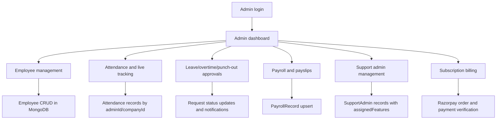

### 5.2 Support Admin Workflow

1. Admin creates a support admin from `SupportAdminManagement.jsx`.
2. Backend stores the support admin in `supportAdminModel` with:
   - `adminId`
   - `supportAdminId`
   - `positionName`
   - `assignedFeatures`
   - `loginEnabled`
3. Support Admin logs in through the admin login attempt or `/api/auth/login`.
4. Backend resolves the root `adminId`.
5. Frontend sends support admin to `/support-admin/dashboard`.
6. Support Admin can access assigned admin pages and personal attendance/profile workflows.

### 5.3 Employee Workflow

1. Employee account is created by Admin or completed through onboarding.
2. Employee logs in through `/api/auth/login`.
3. Backend checks:
   - password
   - `loginEnabled`
   - `isActive` and `status`
   - root Admin subscription access
4. Employee dashboard loads with attendance, leave, notices, work tracker, payroll, and profile data.
5. Employee can:
   - Punch in/out.
   - Request leave, overtime, work mode, attendance correction, punch-out correction.
   - Track daily work.
   - Read notices and notifications.
   - View payslip and attendance history.
   - Submit documents/resignation/issues.

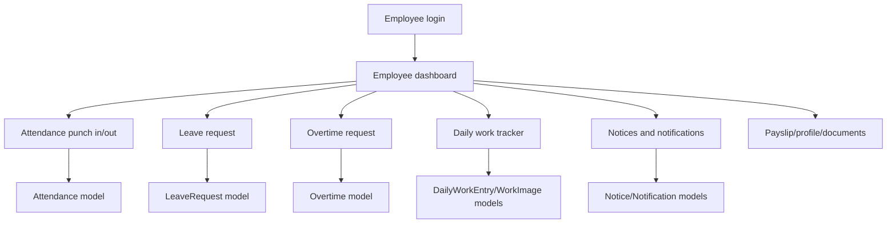

### 5.4 Master Admin Workflow

1. Master Admin logs in through `/api/master/login`.
2. `masterToken` is saved in `sessionStorage`.
3. `ProtectedMasterRoute` allows `/master/*` routes.
4. Master Admin can:
   - View all admins/companies.
   - Manage platform plan settings.
   - Manage login access.
   - View total plan value and generated revenue.
   - Handle platform-level issues and demo requests.
   - Manage domains.

## 6. Module Workflows

### 6.1 Attendance Punch-In/Punch-Out

1. Employee or Support Admin opens attendance page/dashboard.
2. Frontend collects location and user identity.
3. API call reaches `/api/attendance`.
4. `protect` verifies token and subscription.
5. Attendance route loads employee, shift, leave, holiday, and existing attendance.
6. Punch-in creates or updates a daily attendance record.
7. Punch-out closes open session, calculates worked seconds, break seconds, status, and category.
8. Emails/notifications can be triggered for irregular attendance.
9. UI refreshes attendance and live counters.

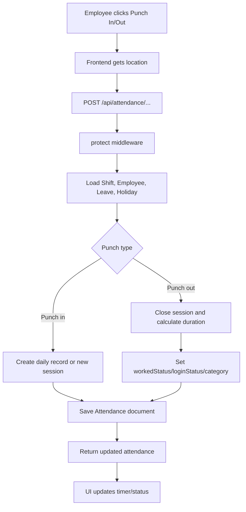

### 6.2 Punch-Out Request Approval

1. Employee submits a punch-out correction request through `/api/punchoutreq/create`.
2. Backend creates `PunchOutRequest` scoped by `adminId`, `companyId`, and `employeeId`.
3. Socket.IO emits `punchout:new`.
4. Admin fetches `/api/punchoutreq/all`.
5. Admin approves/rejects through `/api/punchoutreq/action`.
6. On approval, backend updates the nested daily attendance record, closes open session, recalculates worked time, and emits `punchout:updated`.

### 6.3 Leave Request Approval

1. Employee/support-admin submits leave via `/api/leaves/apply`.
2. Backend validates date range, policy, leave balance, paid/unpaid split, sandwich leave, and month key.
3. `LeaveRequest` is created as `Pending`.
4. Admin lists requests through `/api/leaves`.
5. Admin approves/rejects with `/api/leaves/:id/approve` or `/api/leaves/:id/reject`.
6. Approval updates status, action date, approver, and policy counters.
7. UI dashboards and leave summaries refresh.

### 6.4 Overtime Request Approval

1. Employee submits overtime through `/api/overtime/apply`.
2. `Overtime` document stores employee, admin, company, date/time, reason, and status.
3. Admin fetches `/api/overtime/all`.
4. Admin updates status with `/api/overtime/update-status/:id`.
5. Employee can view their requests through `/api/overtime/:employeeId` or cancel through `/api/overtime/cancel/:id`.

### 6.5 Payroll Generation

1. Admin opens payroll page.
2. Frontend loads employees, payroll rules, attendance, leave, and salary details.
3. Backend payroll routes are protected by `protect`.
4. Admin can maintain payroll rules through `/api/payroll/rules`.
5. Payroll generation calculates:
   - worked days
   - full/half/absent days
   - leaves consumed
   - LOP
   - late penalties
   - allowances/deductions
   - net payable salary
6. Saved payroll uses `/api/payroll/save-batch` and creates/upserts `PayrollRecord`.
7. Employee can retrieve payslip through `/api/payroll/record/:employeeId`.

### 6.6 Subscription Renewal

1. Admin opens profile billing modal.
2. Frontend calls `/api/razorpay/next-bill`.
3. Backend calculates:
   - main plan billing amount
   - base user limit
   - same billing day add-ons merged into main bill
   - separate add-on bills
4. Admin clicks Pay Now.
5. Razorpay checkout opens.
6. Payment success posts to `/api/razorpay/verify-payment`.
7. Backend verifies signature, extends plan expiry, records payment ID and amount, and merges same-billing-day add-ons once.
8. Profile refreshes.

### 6.7 Razorpay Payment Flow

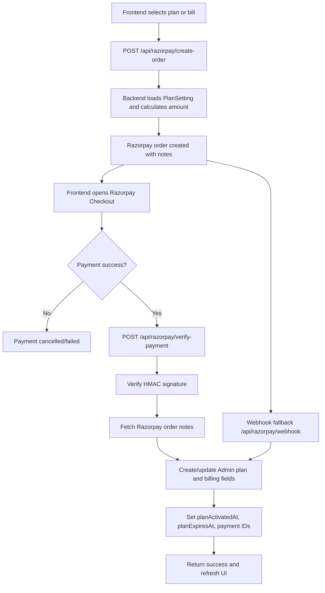

### 6.8 Employee Management CRUD

1. Admin opens employee management.
2. `EmployeeProvider` fetches employees through `/api/employees`.
3. Admin creates employee with `/api/employees`.
4. Backend checks user limit using base plan limit plus active add-ons.
5. Employee is stored with `adminId`, `company`, company snapshot fields, login fields, personal/bank/experience details.
6. Admin can update, deactivate, reactivate, delete, change password, and clear old email.
7. UI state refreshes or updates provider state.

### 6.9 Support Admin Management

1. Admin opens support admin management page.
2. Page loads `/api/admin/profile` and `/api/admin/support-admins`.
3. Admin creates support admin with support admin ID, position name, email, password, and assigned features.
4. Backend stores a `SupportAdmin` with `adminId`.
5. Admin can update position, login status, department, phone, password, and features.
6. Support Admin logs in and inherits tenant scope from `adminId`.

### 6.10 Notification Flow

1. Admin or system creates notification using `/api/notifications`.
2. Notification stores `adminId`, optional `companyId`, optional `userId`, `role`, title, message, type, and read state.
3. Employee/Admin fetches `/api/notifications`.
4. Backend builds a scoped filter:
   - Admin/support-admin sees notifications for their root admin tenant.
   - Employee sees direct notifications and company-scoped employee broadcasts.
5. User marks one or all notifications read.
6. UI counters and notification lists update.

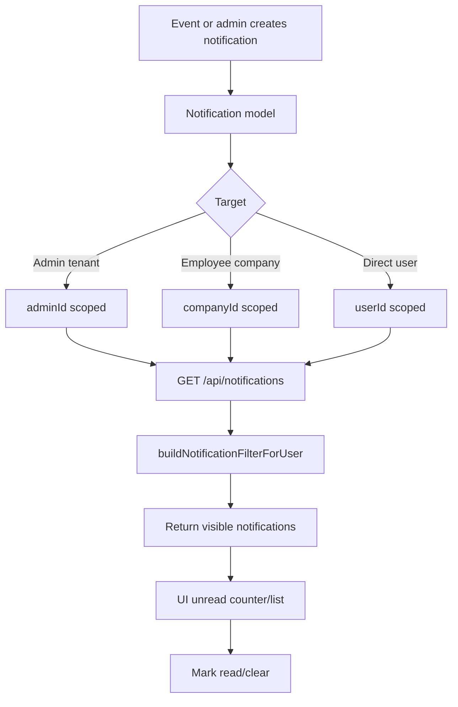

### 6.11 Daily Work Tracker

1. Employee opens daily work tracker.
2. Frontend uses `/api/work` routes.
3. Employee submits work entries, percentages, and optional images.
4. Backend stores work entries/images and calculates daily/monthly performance using utility logic.
5. Admin uses `/api/work/admin` routes to review team work data.

### 6.12 Document Verification

1. Admin/support-admin invites a candidate/employee through `/api/doc-verification/invite` or `/bulk-invite`.
2. Backend creates `DocumentVerification` with token, company, required documents, and status fields.
3. Candidate opens `/document-verification` with token.
4. Public token route validates token and allows file upload/submit.
5. Files are uploaded and stored with document metadata.
6. Admin lists company/all records and verifies individual documents or all documents.
7. Notes and status are stored on the verification record.

## 7. Backend Workflow

### Route to Database Pattern

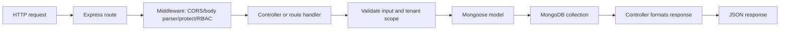

### JWT Verification

- Tokens are signed with `JWT_SECRET`.
- Normal users are resolved by checking Admin, SupportAdmin, then Employee.
- Master Admin uses `protectMaster`.
- Middleware attaches `req.user`.
- For support admins and created admins, `actualId` preserves the real user while `_id` may be mapped to root admin for tenant operations.
- Subscription guard checks root Admin plan expiry plus 7-day grace period.

### RBAC Checks

- Frontend `ProtectedRoute` checks allowed roles.
- Backend `onlyAdmin` restricts admin-only actions.
- `restrictTo` is used in document verification and similar modules.
- Support Admin access is partly controlled through `assignedFeatures`.

### Error Handling

- Route handlers generally use `try/catch`.
- Common responses:
  - `400` invalid request
  - `401` missing/invalid auth
  - `403` unauthorized, disabled login, or expired subscription
  - `404` not found
  - `500` server error
- Global API 404 and error handlers are defined in `app.js`.

### Socket.IO Events

- Socket.IO is initialized in `app.js`.
- Clients can register/authenticate by user ID.
- Request workflows emit events such as:
  - `punchout:new`
  - `punchout:updated`
- Controllers can access Socket.IO through `req.app.get("io")`.

## 8. Frontend Workflow

### Page Load

1. React Router matches route.
2. PublicRoute/ProtectedRoute validates session.
3. Layout mounts.
4. Context providers load shared data.
5. Page component loads page-specific data.
6. Loading state renders spinner/skeleton.
7. Response data is stored in state and rendered.

### API Call Flow

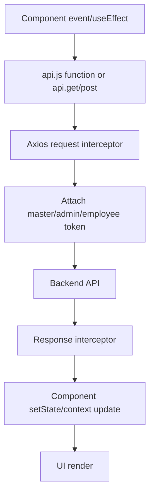

### State Management

- Auth state: `AuthProvider`.
- Employees: `EmployeeProvider`.
- Attendance: `AttendanceProvider` plus employee-specific providers.
- Leave: `LeaveRequestProvider` and employee leave providers.
- Overtime: `OvertimeProvider`.
- Notices/notifications: `NoticeProvider`, `NotificationProvider`, employee notification providers.
- Local state: forms, modals, filters, pagination, loading flags, and request processing flags.

### Modal/Form Submission

1. User opens modal/form.
2. Component validates local fields.
3. Submit button sets loading flag.
4. API request is sent.
5. Success closes modal, resets form, refreshes data, and shows alert/toast.
6. Failure shows error through SweetAlert, alert, toast, or inline message.

### Protected Routing

- Master routes require `masterToken`.
- Admin/support-admin routes require user role in `["admin", "support-admin"]`.
- Employee routes require role `employee`.
- Public route redirects already logged-in users to their dashboard.

## 9. Database Workflow

### Main Collections and Responsibilities

| Model | Purpose |
| --- | --- |
| `Admin` | Tenant owner, subscription, billing, base user limit, add-ons |
| `SupportAdmin` | Delegated admin user linked to Admin |
| `Employee` | Employee profile, login, company mapping, personal/bank/experience data |
| `Company` | Company entity under Admin |
| `Attendance` | Per-employee daily attendance sessions and status requests |
| `LeaveRequest` | Leave applications and approval lifecycle |
| `LeavePolicy` | Admin-specific leave policy and paid-day rules |
| `Overtime` | Overtime applications and approval lifecycle |
| `PunchOutRequest` | Employee punch-out correction requests |
| `PayrollRecord` | Saved monthly payroll and payslip data |
| `PayrollRule` | Admin payroll configuration |
| `Notification` | Tenant-scoped notifications |
| `Notice` | Admin announcements/notices and replies |
| `DailyWorkEntry` / `WorkImage` | Daily work tracker data and images |
| `DocumentVerification` | Candidate/employee document verification token flow |
| `PlanSetting` | Subscription plan duration, price, billing cycle, max users, features |
| `MasterAdmin` | Platform master account |
| `FaceDescriptor` / `WebAuthnCredential` | Biometric login setup |
| `Shift` / `OfficeSettings` | Shift and location settings |
| `Group` | Employee/team grouping |
| `Resignation`, `WelcomeKit`, `InductionDispatch` | HR lifecycle workflows |

### Tenant Isolation

- `Admin` owns the tenant.
- `Company` is linked to Admin.
- `Employee` stores `adminId` and `company`.
- `SupportAdmin` stores `adminId`.
- Attendance, leave, payroll, notifications, documents, groups, shifts, and requests usually store `adminId` and/or `companyId`.
- Backend queries filter by `req.user._id`, `req.user.adminId`, or resolved root Admin.

### Employee-to-Admin Mapping

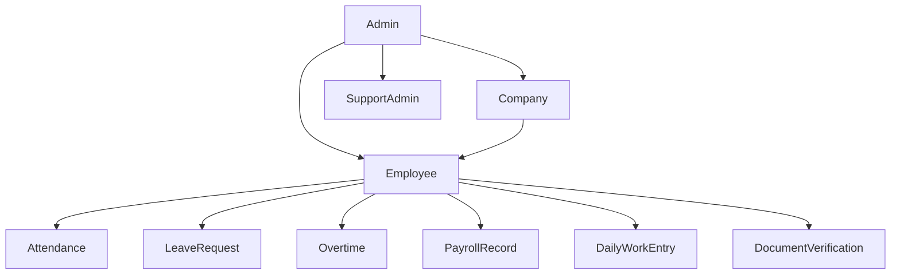

### Database Relationship Flow

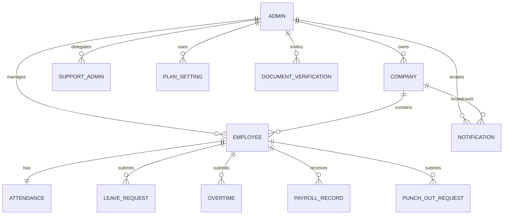

## 10. Codebase Route Map

The backend route registry in `BACKEND/app.js` mounts the HRMS modules as follows:

| Base API | Main Responsibility |
| --- | --- |
| `/api/auth` | Employee/general login |
| `/api/admin` | Admin auth, profile, plans, support admins, location settings |
| `/api/master` | Master Admin login and platform admin listing/settings |
| `/api/employees` | Employee CRUD, activation/deactivation, document upload, user limit enforcement |
| `/api/companies` | Company CRUD and employee ID generation |
| `/api/attendance` | Employee attendance, punch-in/out, corrections, full-day requests, admin attendance reports |
| `/api/admin/attendance` | Admin attendance range utilities |
| `/api/punchoutreq` | Punch-out correction request lifecycle |
| `/api/leaves` | Leave application, approval, policy, balance, cancellation |
| `/api/overtime` | Overtime application, approval, cancellation |
| `/api/payroll` | Payroll rules, batch save, payroll candidates, employee payroll records |
| `/api/notifications` | Notification CRUD/read-state flow |
| `/api/notices` | Admin notices, replies, notice board |
| `/api/work` | Employee daily work tracker |
| `/api/work/admin` | Admin work tracker review and analytics |
| `/api/doc-verification` | Document verification invite/token/upload/admin review |
| `/api/razorpay` | Subscription orders, payment verification, add-ons, billing history |
| `/api/shifts` | Shift assignment and shift lookup |
| `/api/work-mode` | Work mode request and approval |
| `/api/rules` | Admin rules/images and employee rule view |
| `/api/profile` | Profile picture upload/read/delete |
| `/api/issues` | Admin/employee/master issue tracking |
| `/api/induction` | Induction dispatch/history |
| `/api/resignations` | Employee resignation and admin exit workflow |
| `/api/welcome-kit` | Welcome kit checklist/return/status |
| `/api/domain` | Tenant domain/subdomain settings |
| `/api/face-auth` | Face login/register/status |
| `/api/webauthn` | Fingerprint/WebAuthn register/login/credentials |

## 11. Frontend Route Map

The React router in `FRONTEND/src/App.jsx` groups the application into public, master, admin/support-admin, and employee sections.

| Route Group | Layout/Protection | Representative Pages |
| --- | --- | --- |
| Public | `PublicRoute` | `/`, `/login`, `/request-demo`, `/payment-success`, `/employee-onboarding`, `/document-verification` |
| Master | `ProtectedMasterRoute` + `LayoutMaster` | `/master/dashboard`, `/master/admins`, `/master/settings`, `/master/manage-logins`, `/master/manage-issues`, `/master/domain-settings` |
| Admin/Support Admin | `ProtectedRoute allow={["admin","support-admin"]}` + `LayoutAdmin` | `/admin/dashboard`, `/employees`, `/attendance`, `/leave-management`, `/admin/payroll`, `/admin/doc-verify-portal`, `/support-admin/dashboard` |
| Employee | `ProtectedRoute role="employee"` + `LayoutEmployee` | `/employee/dashboard`, `/employee/attendance`, `/employee/leave-management`, `/employee/empovertime`, `/employee/daily-work-tracker`, `/employee/payslip` |

Important frontend providers:

- `AuthProvider`: restores session and performs admin-first, employee-fallback login.
- `EmployeeProvider`: loads and mutates employee state for admin/support-admin screens.
- `AttendanceProvider`: wraps attendance state and dashboard data.
- `LeaveRequestProvider`: maintains leave requests and approval state.
- `OvertimeProvider`: maintains overtime request state.
- `NoticeProvider` and notification providers: notice board and notification state.
- `CurrentEmployee*Provider`: employee-specific attendance, leave, notification, and settings state.

## 12. Extended Module Workflow Diagrams

### 12.1 Leave Approval Workflow

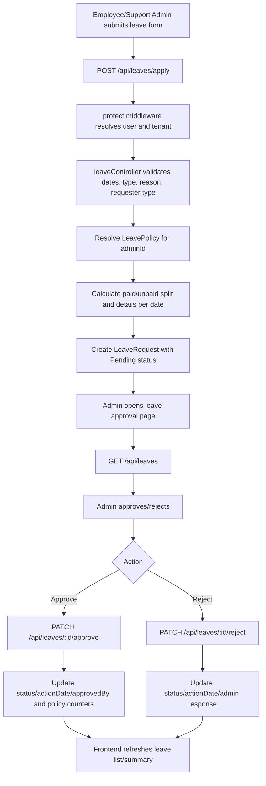

### 12.2 Payroll Generation Workflow

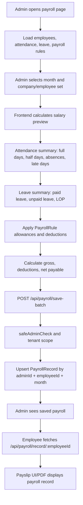

### 12.3 Employee CRUD and User Limit Workflow

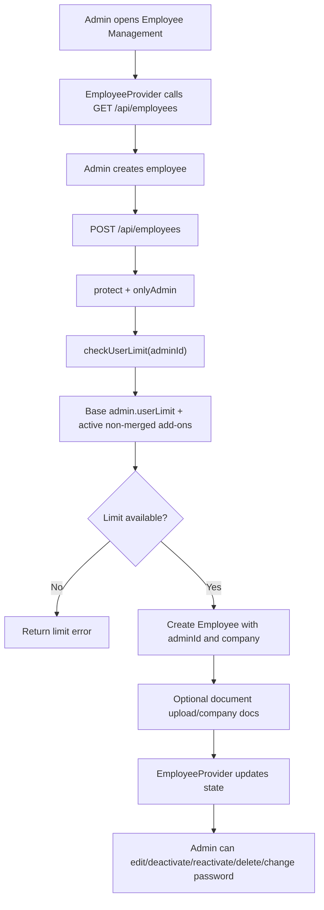

### 12.4 Support Admin Management Workflow

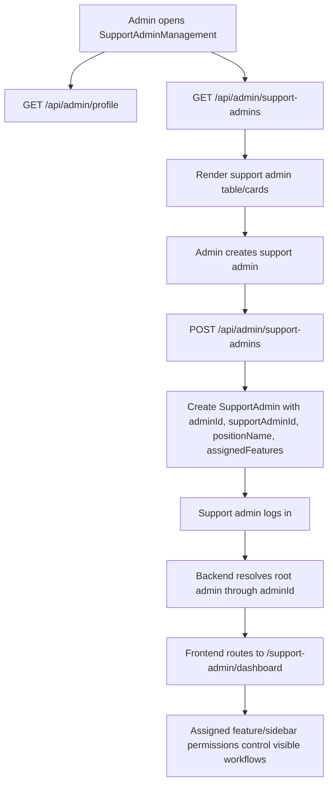

### 12.5 Work Mode Request Workflow

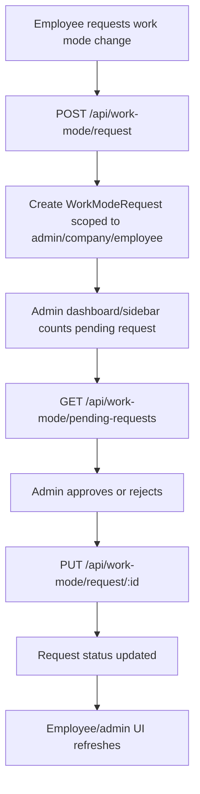

### 12.6 Daily Work Tracker Workflow

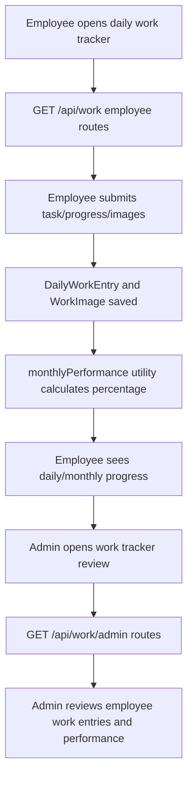

### 12.7 Document Verification Workflow

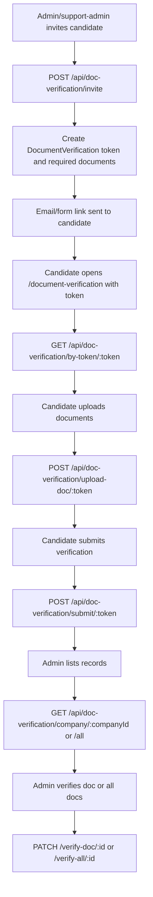

### 12.8 Issue Management Workflow

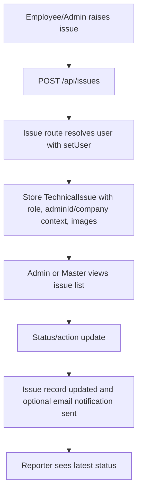

### 12.9 Subscription Access Enforcement Workflow

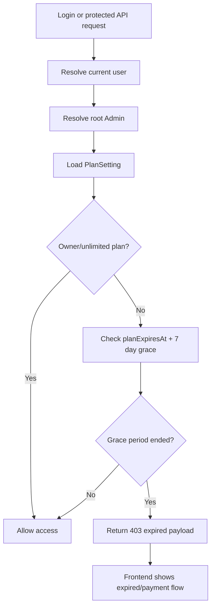

### 12.10 Biometric Login Workflow

```mermaid
flowchart TD
  A["User opens face/fingerprint setup"] --> B["Protected setup route"]
  B --> C{"Method"}
  C -->|Face| D["POST /api/face-auth/register"]
  C -->|WebAuthn| E["POST /api/webauthn/register/options and /verify"]
  D --> F["Store FaceDescriptor"]
  E --> G["Store WebAuthnCredential"]
  H["Biometric login attempt"] --> I{"Method"}
  I -->|Face| J["POST /api/face-auth/login"]
  I -->|Fingerprint| K["POST /api/webauthn/login/options and /verify"]
  J --> L["Resolve user and role"]
  K --> L
  L --> M["Return JWT and login method"]
  M --> N["Frontend stores session and routes by role"]
```

## 13. End-to-End HRMS Lifecycle

```mermaid
flowchart TD
  A["Master/Admin configures plans and subscription"] --> B["Admin account active"]
  B --> C["Admin creates company"]
  C --> D["Admin creates employees/support admins"]
  D --> E["Employees complete onboarding/documents"]
  E --> F["Daily operations begin"]
  F --> G["Attendance punch in/out"]
  F --> H["Leave/overtime/work-mode requests"]
  F --> I["Daily work tracker and notices"]
  G --> J["Monthly attendance summary"]
  H --> J
  I --> J
  J --> K["Payroll generation and payslip"]
  K --> L["Reports, issues, resignations, welcome kit, induction"]
  L --> M["Subscription renewal/add-on billing"]
  M --> B
```

## 14. Interview Explanation Summary

This HRMS works as a tenant-based SaaS system. The Admin is the tenant owner, and almost every operational record is scoped through `adminId` and often `companyId`. Authentication returns a JWT and role, which the frontend stores in session storage. React protects routes by role, while the backend verifies tokens, resolves the actual user, checks RBAC, and enforces subscription status.

Operational modules follow a consistent pattern:

1. User action in React.
2. Axios request with JWT.
3. Express route receives request.
4. Middleware validates auth, role, tenant, and subscription.
5. Controller validates input and applies business rules.
6. Mongoose model reads/writes MongoDB.
7. Optional Socket.IO, email, notification, or payment provider integration runs.
8. JSON response updates React state and UI.

The most important architecture points are tenant isolation, role-based access, modular HR workflows, subscription billing enforcement, and real-time/request-driven updates.
