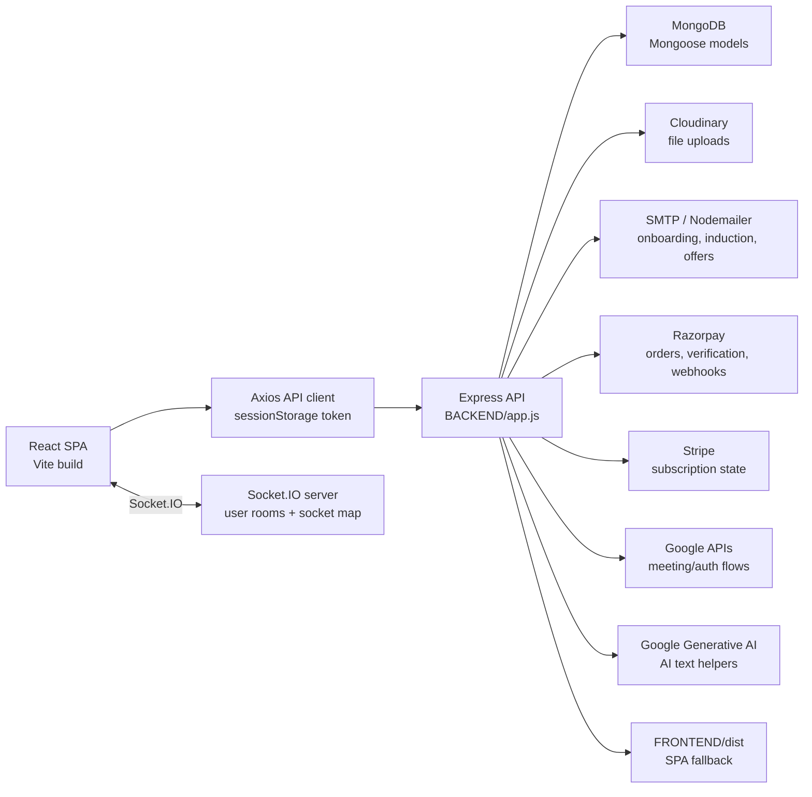
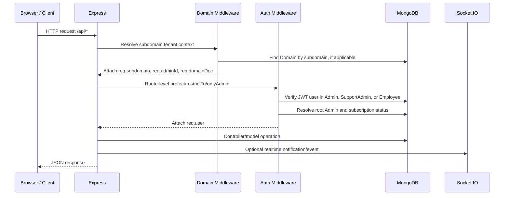
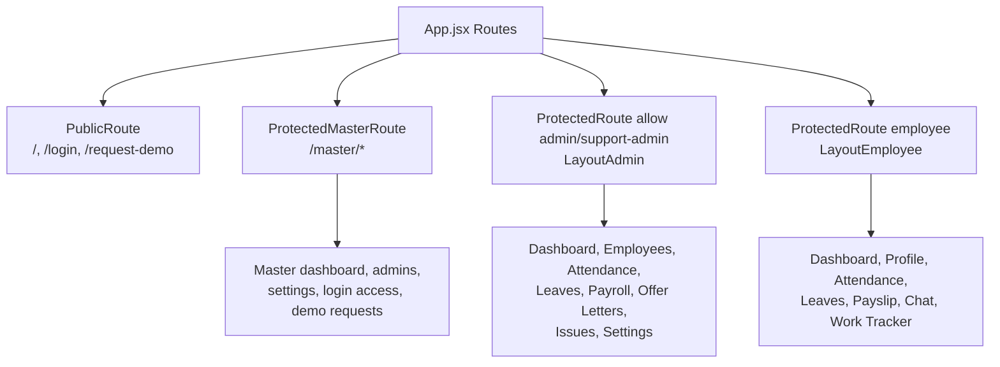
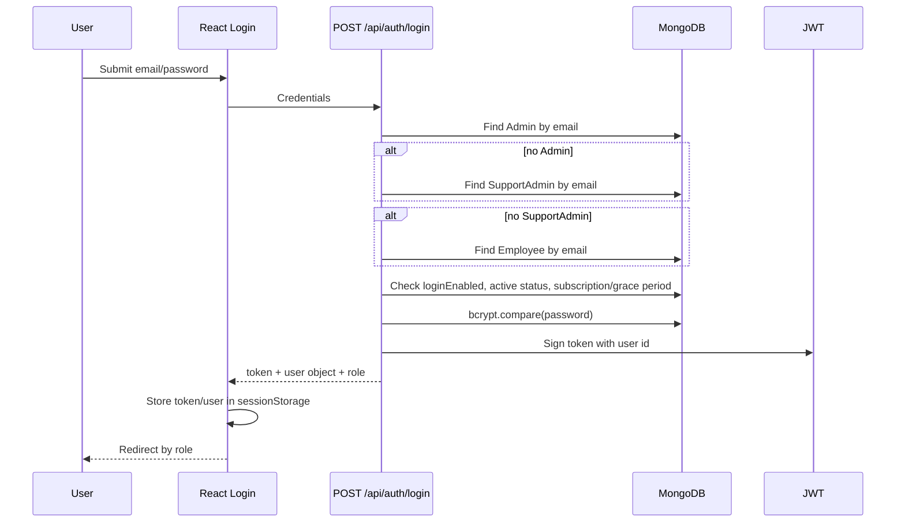
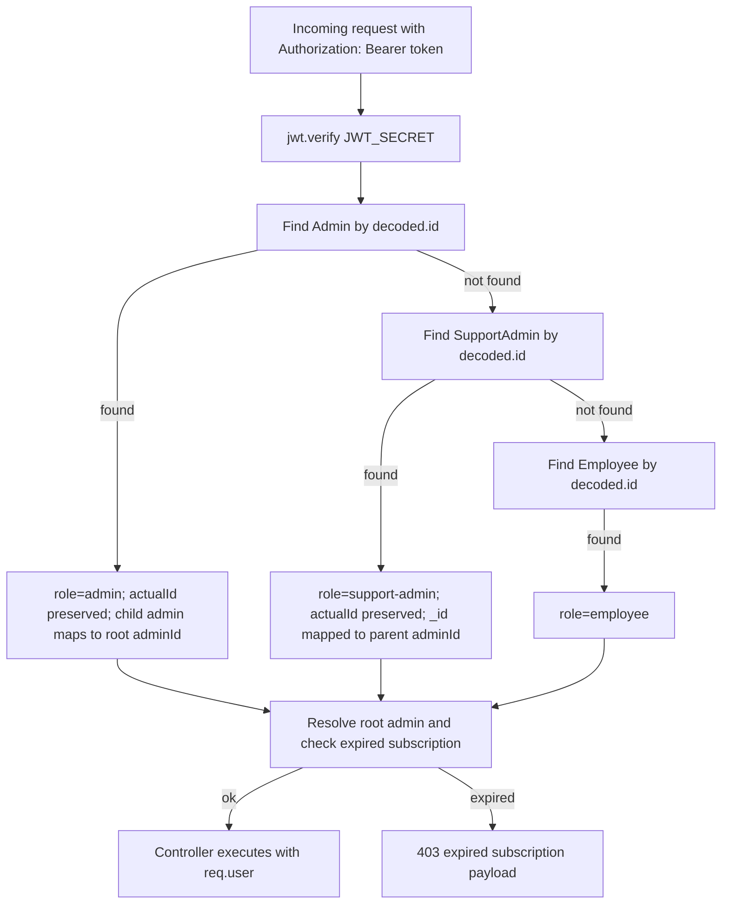
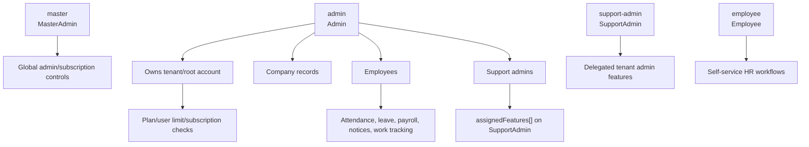
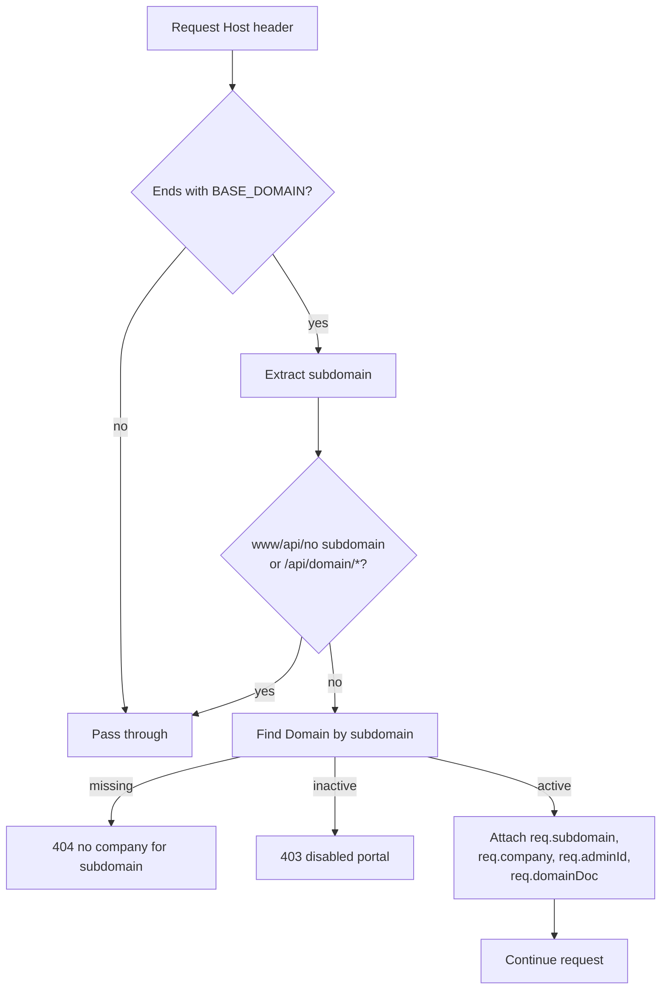
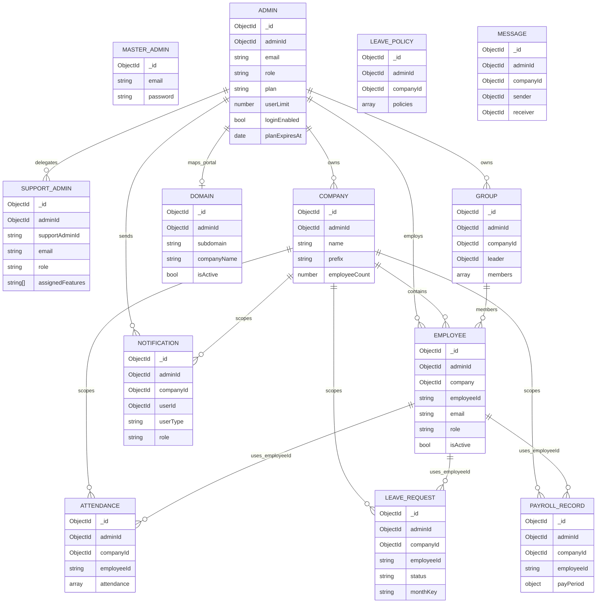
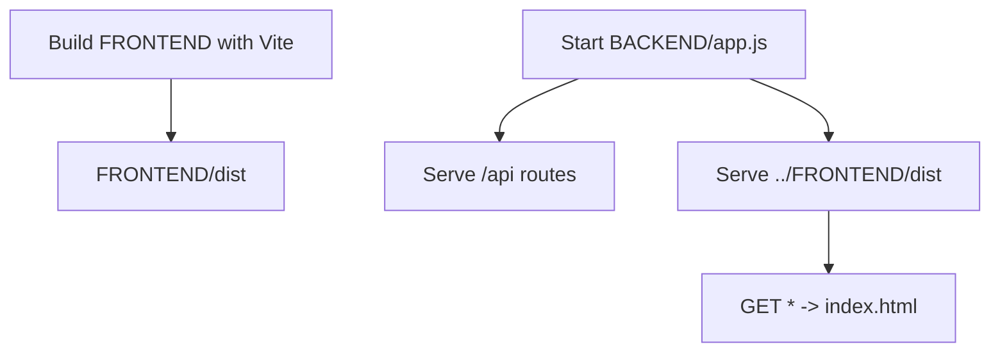

# HRMS Subscription Technical Architecture

Generated from source inspection of `BACKEND` and `FRONTEND`.

## 1. Executive Summary

HRMS Subscription is a multi-tenant HR management system built as a React/Vite frontend and an Express/Mongoose backend. The backend exposes a large REST API under `/api/*`, serves the production frontend build, uses MongoDB for persistence, Socket.IO for realtime notifications/chat/attendance events, and integrates with external services including Razorpay, Stripe, Cloudinary, Nodemailer/SMTP, Google APIs, and Gemini.

The core tenant boundary is the root `Admin`. Most operational records carry `adminId`, and many also carry `companyId`. Support admins and employees inherit access from a root admin. Subscription status is checked during login and in protected middleware, with a 7-day grace period.

## 2. Technology Stack

| Layer | Technology | Notes |
|---|---|---|
| Frontend | React 19, Vite 7, React Router 7 | SPA with admin, employee, support-admin, and master-admin routes |
| Styling/UI | Tailwind CSS, Radix UI, lucide-react, chart libraries | Multiple dashboards and operational pages |
| Backend | Node.js 18+, Express 4 | REST API plus static frontend serving |
| Database | MongoDB via Mongoose 8 | Multi-tenant collections with `adminId`/`companyId` ownership |
| Realtime | Socket.IO 4 | Chat, notifications, request status updates, attendance events |
| Auth | JWT, bcrypt/bcryptjs, WebAuthn, face descriptors | Password login, biometric login/setup, master-admin login |
| Files | Multer, Cloudinary, local `/public` | Profile pics, documents, offer templates, resignation docs |
| Payments | Razorpay, Stripe | Subscription plans, add-ons, billing history |
| AI/Automation | Google Generative AI, Google APIs | Announcement/reason generation and meeting integration |

## 3. High-Level System Architecture

## 4. Runtime Request Pipeline

## 5. Backend Architecture

`BACKEND/app.js` is the composition root. It configures:

| Concern | Implementation |
|---|---|
| Environment | `dotenv.config()` |
| HTTP server | `http.createServer(app)` |
| CORS | Explicit origins plus wildcard subdomains of `vwsync.com` |
| Tenant routing | `subdomainMiddleware` before CORS/routes |
| Body parsing | JSON and URL-encoded payloads up to `50mb` |
| Realtime | `Socket.IO` with polling/websocket transports |
| Security headers | `X-Content-Type-Options`, `X-Frame-Options`, `X-XSS-Protection` |
| Database | Direct `mongoose.connect(process.env.MONGO_URI)` |
| Static files | `/public` and `../FRONTEND/dist` |
| Fallback | Non-API requests serve `FRONTEND/dist/index.html` |
| Error handling | JSON error response after routes |

### Route Modules

| Base path | Route file | Functional area |
|---|---|---|
| `/api/auth` | `authRoutes.js` | Unified login for admin, support-admin, employee |
| `/api/admin` | `adminAuthRoutes.js`, `locationsetting.js` | Admin auth/profile/plans/support admins and office/work-mode settings |
| `/api/master` | `masterRoutes.js` | Master-admin login and global admin management |
| `/api/domain` | `Domainroutes.js` | Company subdomain lifecycle |
| `/api/companies` | `companyRoutes.js` | Company CRUD and employee ID generation |
| `/api/employees` | `employeeRoutes.js` | Employee CRUD, document upload, activation/deactivation |
| `/api/attendance` | `EmployeeattendanceRoutes.js` | Punching, corrections, daily/admin attendance reports |
| `/api/admin/attendance` | `AdminAttendanceRoutes.js` | Admin date-range attendance |
| `/api/leaves` | `leaveRoutes.js` | Leave requests and leave policy |
| `/api/overtime` | `overtimeRoutes.js` | Overtime requests and approval |
| `/api/payroll` | `payroll.js`, `payrollcandidatesRoutes.js` | Payroll rules, records, candidate management |
| `/api/notifications` | `notificationRoutes.js` | Notifications and read state |
| `/api/notices` | `noticeRoutes.js` | Notice board and replies |
| `/api/chat` | `messageRoutes.js` | Direct messaging, unread counts |
| `/api/groups` | `groupRoutes.js` | Teams/groups and membership |
| `/api/profile` | `ProfilePicRoute.js` | Profile photos |
| `/api/holidays` | `holidayRoutes.js` | Holiday calendar |
| `/api/shifts` | `shiftRoutes.js` | Shift assignment |
| `/api/idletime` | `idleTimeRoutes.js` | Tracker settings, idle/live screenshots |
| `/api/work` and `/api/work/admin` | `workRoutes.js` | Daily work tracker |
| `/api/work-mode` | `requestWorkModeRoutes.js` | Work mode requests |
| `/api/punchoutreq` | `punchOutRequestRoutes.js` | Punch-out request workflow |
| `/api/issues` | `issueRoutes.js` | Technical issues |
| `/api/offer-letters` | `offerLetterRoutes.js`, `offerResponseRoutes.js` | Offer employee import, templates, generation, email responses |
| `/api/doc-verification` | `documentVerificationRoutes.js` | Candidate document verification |
| `/api/invited-employees` | `invitedEmployeeRoutes.js` | Onboarding invitations |
| `/api/induction` | `inductionRoutes.js` | Induction dispatch history |
| `/api/resignations` | `resignationRoutes.js` | Employee resignation and exit workflow |
| `/api/welcome-kit` | `Welcomekitroutes.js` | Welcome-kit acknowledgements |
| `/api/webauthn` | `webauthnRoutes.js` | Fingerprint/passkey registration and login |
| `/api/face-auth` | `faceAuthRoutes.js` | Face descriptor registration/login |
| `/api/razorpay` | `razorpayRoutes.js` | Orders, verification, billing, add-ons, webhook |
| `/api/ai` | `aiRoutes.js` | AI reason/announcement generation |
| `/api/meetings` | `meetingRoutes.js` | Google meeting auth and creation |
| `/api/mail` | `mailRoutes.js` | Onboarding/induction email |
| `/api/demo-request` | `Demorequest.js` | Public demo request management |

## 6. Frontend Architecture

The frontend is a Vite React SPA. `FRONTEND/src/App.jsx` defines public, master, admin/support-admin, and employee route trees.

The central Axios client in `FRONTEND/src/api.js`:

- Chooses `VITE_API_URL_PRODUCTION` in production and `VITE_API_URL_DEVELOPMENT` or `http://localhost:5000` in development.
- Sends bearer tokens from `sessionStorage` (`masterToken`, `token`, `hrms-token`, or legacy `hrmsUser.token`).
- Uses a very high timeout of `500000ms`.
- Exports domain-specific API helper functions used by pages and providers.

## 7. Authentication Flow

### Standard Login

### Protected Request

### Master Admin

Master auth is separate:

- `POST /api/master/login` checks `MasterAdmin`.
- `protectMaster` verifies JWT and attaches `req.master`.
- Master routes manage global admin/subscription visibility.

### Biometric Auth

| Auth type | Routes | Purpose |
|---|---|---|
| WebAuthn | `/api/webauthn/register/options`, `/register/verify`, `/login/options`, `/login/verify`, `/credentials` | Passkey/fingerprint registration and authentication |
| Face auth | `/api/face-auth/login`, `/register`, `/status`, `/remove` | Face descriptor login/setup/removal |

## 8. RBAC Structure

| Role | Stored in | Access pattern |
|---|---|---|
| `master` | `MasterAdmin` | Global management under `/api/master`; separate JWT guard |
| `admin` | `Admin` | Tenant owner; allowed by `onlyAdmin` and `restrictTo("admin", "support-admin")` |
| `support-admin` | `SupportAdmin` | Delegated admin; tied to parent `adminId`; feature list stored in `assignedFeatures` |
| `employee` | `Employee` | Employee self-service; attendance, leave, notices, profile, work tracker, resignation |
| `manager` | `Employee.role` enum | Present in schema, but most guards treat non-admin users as employee-level |

Important RBAC implementation notes:

- `onlyAdmin` allows both `admin` and `support-admin`.
- `restrictTo("admin", "support-admin")` is used in selected route modules.
- Frontend route gating uses `ProtectedRoute allow={["admin", "support-admin"]}` for admin layout and `role="employee"` usage for employee layout, although the current component only checks the `allow` prop.
- Several admin/master management endpoints are currently public/unspecified at route level; see recommendations.

## 9. Tenant/Subdomain Flow

`Domain` has unique indexes on `subdomain` and `adminId`, so each root admin can own one active portal name.

## 10. Database Schema Relationships

### Important Collections

| Collection/model | Purpose | Key relationships/indexes |
|---|---|---|
| `Admin` | Tenant owner, billing/subscription, login access | Optional self-reference `adminId`; unique `email` |
| `SupportAdmin` | Delegated admin user | Required `adminId -> Admin`; unique `email`; `assignedFeatures[]` |
| `Company` | Company profile and office location | Required `adminId -> Admin`; unique `prefix` |
| `Employee` | Employee profile and login | Required `adminId -> Admin`, `company -> Company`; unique `employeeId`, `email` |
| `Domain` | Subdomain portal | Unique `subdomain`, unique `adminId` |
| `Attendance` | Daily attendance arrays by employee | `adminId`, `companyId`; unique `employeeId` |
| `AttendanceRequest` | Attendance correction/full-day requests | Index `{ employeeId, date, requestStatus }` |
| `LeaveRequest` | Leave lifecycle | `adminId`, `companyId`, `employeeId`, `monthKey` |
| `LeavePolicy` | Per-admin leave policy and flags | Unique `adminId`; `companyId` |
| `PayrollRecord` | Monthly payroll/payslip data | Unique `{ employeeId, payPeriod.monthIdentifier, adminId }` |
| `Message` | Chat messages | Indexes sender/receiver/time and receiver/read |
| `Notification` | User/role notifications | `refPath` via `userType`; `adminId`, `companyId` |
| `Group` | Team/group structure | `adminId`, `companyId`, leader and members referencing employees |
| `ProfilePic` | Profile image metadata | `adminId`, `companyId` |
| `OfficeSettings` | Geofence/work mode config | `adminId`, `companyId` |
| `WorkModeRequest`, `PunchOutRequest`, `Overtime`, `Expense`, `Holiday`, `Notice`, `Rule`, `WelcomeKit`, `Resignation` | Tenant-scoped HR workflows | Generally `adminId` and `companyId` |
| `PlanSetting`, `Feature` | Subscription feature configuration | Plan feature route lists |
| `WebAuthnCredential`, `FaceDescriptor` | Biometric auth | User identity plus unique user/role/type indexes |

## 11. API Inventory

Auth notation:

- `Public/unspecified`: no route-level auth guard detected in static inspection.
- `Bearer JWT`: protected by `protect`.
- `admin/support-admin`: protected by `onlyAdmin`, `safeAdminCheck`, or `restrictTo("admin", "support-admin")`.
- `master JWT`: protected by `protectMaster`.

### Authentication and Identity

| Method | Path | Auth | Purpose |
|---|---|---|---|
| POST | `/api/auth/login` | Public | Unified admin/support-admin/employee login |
| POST | `/api/admin/register` | Public/unspecified | Register admin |
| POST | `/api/admin/login` | Public/unspecified | Admin-specific login |
| GET | `/api/admin/profile` | Bearer JWT | Current admin/support-admin profile |
| PUT | `/api/admin/profile/update` | Bearer JWT | Update admin/support-admin profile |
| POST | `/api/users/change-password` | Bearer JWT | Change current user password |
| PUT | `/api/users/profile` | Bearer JWT | Update current user profile |
| POST | `/api/master/login` | Public | Master-admin login |
| GET | `/api/master/admins` | master JWT | List admins/subscription stats |
| PUT | `/api/master/settings` | master JWT | Update global settings stub |

### Admin, Plans, Login Access

| Method | Path | Auth |
|---|---|---|
| GET | `/api/admin/all-admins` | Public/unspecified |
| GET | `/api/admin/all-plans` | Public/unspecified |
| GET | `/api/admin/all-features` | Bearer JWT |
| GET | `/api/admin/my-plan-features` | Bearer JWT |
| PATCH | `/api/admin/plan-settings` | Public/unspecified |
| DELETE | `/api/admin/delete-plan/:id` | Public/unspecified |
| GET | `/api/admin/login-access` | Public/unspecified |
| PATCH | `/api/admin/login-access/admin/:adminId` | Public/unspecified |
| PATCH | `/api/admin/login-access/employees/:adminId` | Public/unspecified |
| PATCH | `/api/admin/change-password/:adminId` | Public/unspecified |
| DELETE | `/api/admin/delete-admin/:adminId` | Public/unspecified |
| POST | `/api/admin/free-upgrade-to-owner` | Bearer JWT |
| GET/POST | `/api/admin/support-admins` | Bearer JWT |
| PUT/DELETE | `/api/admin/support-admins/:id` | Bearer JWT |

### Tenant, Domain, Company, Employee

| Method | Path | Auth |
|---|---|---|
| GET | `/api/domain/check/:subdomain` | Public |
| POST | `/api/domain/create` | Bearer JWT |
| GET | `/api/domain/my-domain` | Bearer JWT |
| PUT | `/api/domain/update` | Bearer JWT |
| DELETE | `/api/domain/disable` | Bearer JWT |
| PATCH | `/api/domain/enable` | Bearer JWT |
| GET/POST | `/api/companies` | Bearer JWT; admin/support-admin |
| GET/PUT/DELETE | `/api/companies/:id` | Bearer JWT; admin/support-admin |
| POST | `/api/companies/generate-id` | Bearer JWT; admin/support-admin |
| GET | `/api/companies/next-id/:companyId` | Bearer JWT; admin/support-admin |
| GET/POST | `/api/employees` | Bearer JWT; POST admin/support-admin |
| GET/PUT/DELETE | `/api/employees/:id` | Bearer JWT; DELETE admin/support-admin |
| GET | `/api/employees/next-id/:companyId` | Bearer JWT; admin/support-admin |
| POST | `/api/employees/upload-doc` | Bearer JWT |
| PATCH | `/api/employees/:id/change-password` | Bearer JWT; admin/support-admin |
| PATCH | `/api/employees/:id/deactivate` | Bearer JWT; admin/support-admin |
| PATCH | `/api/employees/:id/reactivate` | Bearer JWT; admin/support-admin |
| PATCH | `/api/employees/:id/clear-old-email` | Bearer JWT |
| POST | `/api/employees/idle-activity` | Bearer JWT |

### Attendance, Shifts, Work Mode

| Method | Path | Auth |
|---|---|---|
| GET | `/api/attendance/:employeeId` | Bearer JWT |
| GET | `/api/attendance/all` | Bearer JWT; admin/support-admin |
| POST | `/api/attendance/punch-in` | Bearer JWT |
| POST | `/api/attendance/punch-out` | Bearer JWT |
| POST | `/api/attendance/punch-break` | Bearer JWT |
| POST | `/api/attendance/admin-punch-out` | Bearer JWT; admin/support-admin |
| GET | `/api/attendance/my-corrections` | Bearer JWT |
| POST | `/api/attendance/request-correction` | Bearer JWT |
| POST | `/api/attendance/request-correction-advanced` | Bearer JWT |
| GET | `/api/attendance/admin/pending-corrections` | Bearer JWT; admin/support-admin |
| POST | `/api/attendance/admin/act-on-correction` | Bearer JWT; admin/support-admin |
| POST | `/api/attendance/request-status-correction` | Bearer JWT |
| POST | `/api/attendance/approve-status-correction` | Bearer JWT; admin/support-admin |
| POST | `/api/attendance/reject-status-correction` | Bearer JWT; admin/support-admin |
| GET | `/api/attendance/admin/status-correction-requests` | Bearer JWT; admin/support-admin |
| POST | `/api/attendance/request-full-day` | Bearer JWT |
| GET | `/api/attendance/admin/full-day-requests` | Bearer JWT; admin/support-admin |
| POST | `/api/attendance/approve-full-day` | Bearer JWT; admin/support-admin |
| POST | `/api/attendance/reject-full-day` | Bearer JWT; admin/support-admin |
| GET | `/api/attendance/admin/date-range` | Bearer JWT; admin/support-admin |
| POST | `/api/attendance/admin/date-range-for-employees` | Bearer JWT; admin/support-admin |
| GET | `/api/attendance/admin/daily-counts` | Bearer JWT; admin/support-admin |
| GET | `/api/attendance/admin/daily-log` | Bearer JWT; admin/support-admin |
| GET | `/api/attendance/admin/daily-status-list` | Bearer JWT; admin/support-admin |
| GET | `/api/admin/attendance/by-range` | Bearer JWT; admin/support-admin |
| GET/PUT | `/api/admin/settings/office` | Bearer JWT |
| PUT | `/api/admin/settings/employee-mode` | Bearer JWT |
| GET | `/api/admin/settings/employee-mode/:employeeId` | Bearer JWT |
| POST | `/api/admin/settings/employee-mode/bulk` | Bearer JWT |
| POST | `/api/admin/settings/employee-mode/reset` | Bearer JWT |
| GET | `/api/admin/settings/employees-modes` | Bearer JWT |
| GET/POST/PUT/DELETE | `/api/admin/requests*` | Bearer JWT |
| GET/POST/DELETE | `/api/shifts/*` | Bearer JWT; admin/support-admin for create/list/delete/bulk |
| POST/GET/PUT | `/api/work-mode/*` | Bearer JWT; admin/support-admin for pending |
| POST/GET/DELETE | `/api/punchoutreq/*` | Bearer JWT; admin/support-admin for all/action/delete |

### Leave, Holidays, Notices, Notifications

| Method | Path | Auth |
|---|---|---|
| GET | `/api/leaves` | Bearer JWT |
| POST | `/api/leaves/apply` | Bearer JWT |
| GET | `/api/leaves/my-leaves` | Bearer JWT |
| GET | `/api/leaves/balance` | Bearer JWT |
| GET/PUT | `/api/leaves/policy` | Bearer JWT; admin/support-admin |
| POST | `/api/leaves/policy/reset` | Bearer JWT; admin/support-admin |
| GET | `/api/leaves/:id/details` | Bearer JWT |
| PATCH | `/api/leaves/:id/approve` | Bearer JWT; admin/support-admin |
| PATCH | `/api/leaves/:id/reject` | Bearer JWT; admin/support-admin |
| DELETE | `/api/leaves/cancel/:id` | Bearer JWT |
| GET | `/api/leaves/:employeeId` | Bearer JWT |
| GET/POST/PUT/DELETE | `/api/holidays` and `/api/holidays/:id` | Bearer JWT; mutations admin/support-admin |
| GET/POST/PUT/DELETE | `/api/notices` and `/api/notices/:id` | Bearer JWT |
| GET | `/api/notices/all` | Bearer JWT; admin/support-admin |
| PUT | `/api/notices/:id/read` | Bearer JWT |
| POST | `/api/notices/:id/reply` | Bearer JWT |
| POST | `/api/notices/:id/admin-reply` | Bearer JWT; admin/support-admin |
| DELETE | `/api/notices/:id/reply/:replyId` | Bearer JWT |
| GET/POST/PATCH | `/api/notifications` and `/api/notifications/:id` | Bearer JWT; create admin/support-admin |
| POST | `/api/notifications/mark-all` | Bearer JWT |
| DELETE | `/api/notifications/clear-all` | Bearer JWT |

### Payroll, Overtime, Work, Tracking

| Method | Path | Auth |
|---|---|---|
| GET/PUT | `/api/payroll/rules` | Bearer JWT; PUT admin/support-admin |
| POST | `/api/payroll/save-batch` | Bearer JWT; admin/support-admin |
| GET | `/api/payroll/record/:employeeId` | Bearer JWT |
| GET | `/api/payroll/all` | Public/unspecified |
| DELETE | `/api/payroll/:id` | Public/unspecified |
| GET | `/api/overtime/:employeeId` | Bearer JWT |
| POST | `/api/overtime/apply` | Bearer JWT |
| GET | `/api/overtime/all` | Bearer JWT; admin/support-admin |
| PUT | `/api/overtime/update-status/:id` | Bearer JWT; admin/support-admin |
| PATCH | `/api/overtime/cancel/:id` | Bearer JWT |
| DELETE | `/api/overtime/delete/:id` | Bearer JWT; admin/support-admin |
| POST/GET | `/api/work/*` | Bearer JWT where defined in route module |
| POST/GET | `/api/work/admin/*` | Bearer JWT/admin where defined in route module |
| GET/PUT/POST | `/api/idletime/*` | Public/unspecified in static route scan |

### Collaboration and Groups

| Method | Path | Auth |
|---|---|---|
| POST | `/api/chat/send` | Bearer JWT |
| GET | `/api/chat/history/:userId` | Bearer JWT |
| GET | `/api/chat/users` | Bearer JWT |
| GET | `/api/chat/unread/count` | Bearer JWT |
| PUT | `/api/chat/read/:senderId` | Bearer JWT |
| PUT/DELETE | `/api/chat/:msgId` | Bearer JWT |
| GET/POST | `/api/groups` | Bearer JWT; admin/support-admin |
| GET/PUT/DELETE | `/api/groups/:id` | Bearer JWT; admin/support-admin |
| PUT | `/api/groups/:id/leader` | Bearer JWT; admin/support-admin |
| POST/DELETE | `/api/groups/:id/member` | Bearer JWT; admin/support-admin |

### Documents, Onboarding, Offers, Exit

| Method | Path | Auth |
|---|---|---|
| POST | `/api/invited-employees/invite` | Public/unspecified |
| POST | `/api/invited-employees/bulk-invite` | Public/unspecified |
| POST | `/api/invited-employees/verify-email` | Public/unspecified |
| POST | `/api/invited-employees/complete-onboarding` | Public/unspecified |
| GET/DELETE | `/api/invited-employees/*` | Public/unspecified |
| GET/POST/PATCH/DELETE | `/api/doc-verification/*` | Public token routes plus admin/support-admin management routes |
| GET/POST/PUT/DELETE | `/api/offer-letters/employees*` | Bearer JWT; admin/support-admin |
| POST | `/api/offer-letters/upload` | Bearer JWT; admin/support-admin |
| POST | `/api/offer-letters/generate` | Bearer JWT; admin/support-admin |
| POST | `/api/offer-letters/download-docx` | Bearer JWT; admin/support-admin |
| POST | `/api/offer-letters/send-email` | Bearer JWT; admin/support-admin |
| GET/POST/DELETE | `/api/offer-letters/templates*` | Mixed public fetch and admin/support-admin management |
| GET | `/api/offer-letters/respond` | Public |
| GET/POST/DELETE | `/api/induction/*` | Bearer JWT; admin/support-admin |
| GET/POST/DELETE | `/api/welcome-kit/*` | Bearer JWT |
| GET/POST/DELETE | `/api/resignations/*` | Bearer JWT; admin/support-admin for admin actions; one system check public |
| POST | `/api/mail/send-onboarding` | Bearer JWT |

### Payments, AI, Meetings, Issues, Miscellaneous

| Method | Path | Auth |
|---|---|---|
| POST | `/api/razorpay/create-order` | Public/unspecified |
| POST | `/api/razorpay/verify-payment` | Public/unspecified |
| POST | `/api/razorpay/webhook` | Public webhook |
| GET | `/api/razorpay/billing-history` | Bearer JWT |
| GET | `/api/razorpay/next-bill` | Bearer JWT |
| POST | `/api/razorpay/create-addon-order` | Bearer JWT |
| POST | `/api/razorpay/verify-addon-payment` | Bearer JWT |
| POST | `/api/ai/optimize-reason` | Public/unspecified |
| POST | `/api/ai/generate-announcement` | Public/unspecified |
| GET | `/api/meetings/auth/url` | Public/unspecified |
| GET | `/api/meetings/auth/callback` | Public/unspecified |
| POST | `/api/meetings/create-meeting` | Public/unspecified |
| GET/POST/PATCH/DELETE | `/api/issues/*` | Uses route-local `setUser`; verify desired access rules |
| GET/POST/DELETE | `/api/rules*` | Mixed public and protected |
| GET/POST/DELETE | `/api/demo-request*` | Public/unspecified |
| GET/PUT/DELETE | `/api/profile/*` | Bearer JWT |
| POST/GET/DELETE | `/api/webauthn/*` | Mixed public login and protected registration/credential management |
| POST/GET/DELETE | `/api/face-auth/*` | Public login; protected registration/status/removal |

## 12. Realtime Architecture

Socket.IO is initialized in `BACKEND/app.js` and attached to the Express app:

- `app.set("io", io)`
- `app.set("userSocketMap", userSocketMap)`

Client/user events:

| Event | Direction | Purpose |
|---|---|---|
| `connection` | client to server | Establish socket |
| `register` | client to server | Map user ID to socket ID |
| `authenticate` | client to server | Join `user_<id>` room |
| `disconnect` | client to server | Remove stale socket mapping |

Route modules access `req.app.get("io")` to emit updates for attendance corrections, punch-out requests, leave/resignation flows, and chat/notifications.

## 13. Deployment and Environment

Expected environment variables include:

| Variable | Purpose |
|---|---|
| `MONGO_URI` | MongoDB connection string |
| `JWT_SECRET` | JWT signing/verification |
| `JWT_EXPIRES_IN` | Optional admin auth expiry override |
| `PORT` | Backend port, default `5000` |
| `BASE_DOMAIN` | Domain middleware base, default `vwsync.com` |
| `VITE_API_URL_PRODUCTION` | Frontend production API base |
| `VITE_API_URL_DEVELOPMENT` | Frontend development API base |
| Razorpay/Stripe keys | Payment provider integration |
| Cloudinary keys | File upload integration |
| SMTP/Nodemailer credentials | Email delivery |
| Google/Gemini credentials | Meeting and AI integrations |

Deployment shape:

## 14. Performance Recommendations

### Database

1. Add compound tenant indexes to high-volume collections:
   - `Attendance`: `{ adminId: 1, companyId: 1, employeeId: 1 }`
   - `LeaveRequest`: `{ adminId: 1, companyId: 1, employeeId: 1, monthKey: 1, status: 1 }`
   - `Notification`: `{ adminId: 1, companyId: 1, userId: 1, isRead: 1, createdAt: -1 }`
   - `Overtime`, `PunchOutRequest`, `WorkModeRequest`, `Resignation`: `{ adminId: 1, companyId: 1, status: 1, createdAt: -1 }`
2. Reconsider `Attendance.employeeId` global uniqueness. The payroll model already scopes uniqueness by `adminId`; attendance may need the same approach if multiple tenants can share employee IDs.
3. Avoid unbounded nested arrays for long-lived attendance records. The current `Attendance.attendance[]` daily array can grow indefinitely per employee; consider one document per employee per month or day.
4. Use `.lean()` consistently for read-heavy list/report endpoints where document methods are not needed.
5. Add pagination to all admin list/report endpoints that can grow: attendance ranges, notifications, idle screenshots, messages, issues, invited employees, resignation history.

### API and Server

1. Reduce `express.json({ limit: "50mb" })` globally. Keep large limits only on specific upload/document routes.
2. Lower Axios timeout from `500000ms` and handle long document generation with explicit progress/status flows.
3. Add request rate limits to auth, biometric login, AI, meetings, demo requests, Razorpay verification, and public document-token endpoints.
4. Add structured logging with request IDs, tenant ID, route, status, latency, and user role.
5. Cache static plan/feature lookups (`PlanSetting`, `Feature`) for short TTLs to reduce repeated queries during auth/sidebar rendering.
6. Move expensive report calculations into aggregation pipelines or background jobs if monthly attendance/payroll reports become slow.

### Frontend

1. Split large route bundles with `React.lazy()` for admin/employee/master sections.
2. Normalize API helper paths; some frontend helpers reference `/api/messages`, `/api/categories`, and `/api/permissions`, while the backend currently mounts `/api/chat`, `/api/category-assign`, and no active permissions route in `app.js`.
3. Add frontend route enforcement for `role="employee"` in `ProtectedRoute`; currently only the `allow` array is checked.
4. Use virtualized tables for attendance, payroll, employee, issue, and document verification lists.
5. Avoid storing large user payloads in `sessionStorage`; keep token plus minimal identity/role and refetch profile as needed.

## 15. Security and Reliability Recommendations

1. Protect public/unspecified admin management endpoints:
   - `/api/admin/all-admins`
   - `/api/admin/all-plans`
   - `/api/admin/plan-settings`
   - `/api/admin/delete-plan/:id`
   - `/api/admin/login-access*`
   - `/api/admin/change-password/:adminId`
   - `/api/admin/delete-admin/:adminId`
2. Verify webhook signatures for Razorpay and Stripe before mutating billing state.
3. Validate tenant ownership in every route that accepts `employeeId`, `companyId`, or document IDs from request params/body.
4. Use `validateUserBelongsToSubdomain` on routes that must be bound to a subdomain tenant.
5. Replace legacy `X-XSS-Protection` reliance with a stricter Content Security Policy and standard Helmet middleware.
6. Ensure uploaded files are type-checked, size-limited per route, malware-scanned where possible, and served with safe headers.
7. Store refresh/session strategy intentionally. Current JWT/sessionStorage approach is simple, but XSS exposure would leak bearer tokens.
8. Add tests around auth middleware, subscription expiry, tenant scoping, and user-limit enforcement.
9. Remove or protect public AI/meeting/demo management endpoints if they are not intentionally public.

## 16. Known Architecture Risks

| Risk | Impact | Suggested action |
|---|---|---|
| Public/unspecified privileged endpoints | Admin/plan/login controls could be callable without intended auth | Add `protectMaster` or `protect + restrictTo` as appropriate |
| Mixed auth middleware implementations | Different route files may attach different `req.user` shapes | Consolidate `protect` into one module |
| Frontend route guard ignores `role` prop | Employee routes may rely more on UI state than intended | Update `ProtectedRoute` to support `role` and `allow` |
| Large request body limit globally | Higher memory pressure and larger attack surface | Apply large limits only to file/document routes |
| Nested attendance array | Query/update cost grows with employee tenure | Model attendance by day/month |
| Inconsistent route naming between frontend/backend | Runtime 404s or dead UI actions | Generate typed API client or route manifest |

## 17. Suggested Next Steps

1. Harden route guards for all public/unspecified admin, payroll candidate, AI, meeting, rule, and tracker endpoints.
2. Add tenant-scoped indexes and review globally unique fields.
3. Consolidate authentication middleware and make `req.user` shape explicit.
4. Add API contract tests for the route inventory above.
5. Add a generated OpenAPI spec from Express routes and keep this architecture doc as the human-readable overview.
